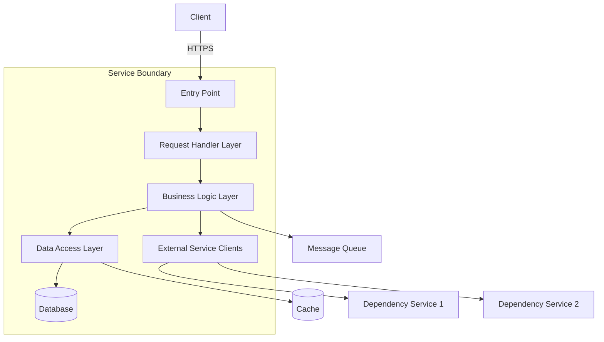

# Architecture: [ServiceName / ComponentName]

This document describes the architecture, code structure, and design decisions for [ServiceName/ComponentName].

> **Related**: For API contracts, see `design/apis/`. For design patterns used in this codebase, see `design/patterns/`. When updating this document, ensure related docs stay consistent.

## Service Overview

- **Team:** [TeamName]
- **Repo:** [repo link]
- **Primary language:** [e.g., Java 21, TypeScript, Python 3.11]
- **Framework:** [e.g., Spring Boot, Express, Coral, FastAPI]
- **Build system:** [e.g., Gradle, Maven, npm, Brazil]
- **Pipeline:** [pipeline link]

## High-Level Architecture Diagram



> Replace with your actual architecture. Use mermaid, ASCII, or link to a diagram.

## Account / Environment Structure

| Environment | Account/Region | Purpose | Access |
|-------------|---------------|---------|--------|
| [Dev] | [account / region] | [Development and unit testing] | [Open to team] |
| [Staging] | [account / region] | [Pre-production validation] | [Restricted] |
| [Prod] | [account / region] | [Production traffic] | [Highly restricted] |

## Code Structure

```
[repo-name]/
├── src/
│   ├── main/
│   │   ├── [language]/com/[org]/[service]/
│   │   │   ├── activity/          # Request handlers / controllers
│   │   │   ├── service/           # Business logic layer
│   │   │   ├── dao/               # Data access objects
│   │   │   │   └── model/         # Data models / POJOs / entities
│   │   │   │       └── pojos/     # Shared data structures
│   │   │   ├── mapper/            # Data mappers (e.g., MapStruct)
│   │   │   ├── validator/         # Input validators
│   │   │   ├── client/            # External service clients
│   │   │   ├── config/            # DI configuration (e.g., Dagger, Spring)
│   │   │   ├── exception/         # Custom exceptions
│   │   │   └── [EntryPoint]       # Main / Lambda handler / App bootstrap
│   │   └── resources/
│   │       └── [config files]
│   └── test/
│       └── [language]/com/[org]/[service]/
│           ├── activity/          # Handler unit tests
│           ├── service/           # Business logic tests
│           ├── dao/               # DAO tests (with local DB)
│           └── integration/       # Integration tests
├── infrastructure/                # IaC (CDK / Terraform / CloudFormation)
│   ├── lib/
│   │   ├── stacks/
│   │   └── constructs/
│   └── bin/
├── design/                        # Design docs (this folder)
├── personas/                      # Agent personas
├── skills/                        # Agent skills
├── AGENTS.md
└── README.md
```

## Key Classes / Modules

### Entry Point

| Class / Module | Responsibility |
|---------------|----------------|
| [EntryPoint.java / app.ts / main.py] | [Bootstrap, DI wiring, server startup or Lambda handler] |

### Request Handler Layer (Activities / Controllers)

| Class | API Operation | Description |
|-------|--------------|-------------|
| [CreateResourceActivity] | POST /resource | [Validates input, delegates to service layer, returns response] |
| [GetResourceActivity] | GET /resource/:id | [Retrieves resource, maps to response DTO] |
| [ListResourcesActivity] | GET /resources | [Paginated listing with filters] |
| [UpdateResourceActivity] | PUT /resource/:id | [Validates update, applies changes] |
| [DeleteResourceActivity] | DELETE /resource/:id | [Soft/hard delete with cleanup] |

### Business Logic Layer (Services)

| Class | Responsibility |
|-------|----------------|
| [ResourceService] | [Core business logic for resource lifecycle] |
| [ValidationService] | [Complex validation rules beyond input validation] |
| [OrchestrationService] | [Coordinates multi-step operations across services] |

### Data Access Layer (DAOs)

| Class | Table/Store | Operations |
|-------|------------|------------|
| [ResourceDao] | [ResourceTable] | [CRUD, query by GSI, batch operations] |
| [AuditDao] | [AuditTable] | [Write-only audit trail] |

### External Clients

| Class | Target Service | Protocol |
|-------|---------------|----------|
| [DependencyClient] | [ServiceName] | [HTTPS / gRPC / SDK] |
| [NotificationClient] | [SNS / SES / Slack] | [AWS SDK] |

### Mappers

| Class | From → To | Notes |
|-------|-----------|-------|
| [RequestMapper] | [API Request DTO → Internal Model] | [MapStruct / manual] |
| [ResponseMapper] | [Internal Model → API Response DTO] | [MapStruct / manual] |
| [CrossServiceMapper] | [Internal Model → External Client Model] | [For service-to-service calls] |

## Data Model

### [Table/Entity 1: e.g., ResourceTable]

- **Type:** [e.g., DynamoDB, RDS Postgres, MongoDB]
- **Key schema:** [PK: resourceId, SK: timestamp]
- **GSIs:** [GSI1: accountId-status-index, GSI2: createdAt-index]
- **Billing:** [On-demand / Provisioned]

| Attribute | Type | Description | Required |
|-----------|------|-------------|----------|
| [resourceId] | String (PK) | [Unique identifier] | Yes |
| [accountId] | String | [Owner account] | Yes |
| [status] | String | [ACTIVE / INACTIVE / DELETED] | Yes |
| [config] | Map | [Resource configuration] | Yes |
| [createdAt] | Number | [Epoch milliseconds] | Yes |
| [updatedAt] | Number | [Epoch milliseconds] | Yes |
| [ttl] | Number | [TTL for auto-cleanup] | No |

### [Table/Entity 2: e.g., NamesTable]

- **Purpose:** [e.g., Ensure name uniqueness per account]
- **Key schema:** [PK: accountId#name]
- **TTL:** [Enabled for cleanup]

### Entity Relationships

```
[Resource] 1──────* [SubResource]
    │                    │
    │                    └──── [AuditEntry]
    │
    └──── [Configuration]
              │
              └──── [Version]
```

## Shared Libraries / Cross-Service Dependencies

### [SharedLibrary: e.g., ServiceCommons]

| What's Shared | Package Path | Consumers |
|--------------|-------------|-----------|
| [Data model POJOs] | [com.org.service.dao.model.pojos] | [ServiceA, ServiceB] |
| [Utility classes] | [com.org.service.utils] | [ServiceA, ServiceB] |
| [Constants / Enums] | [com.org.service.constants] | [ServiceA, ServiceB] |

**Dependency type:** [Compile-time library, not service invocation]

```
┌─────────────────────────────────┐
│  SharedLibrary Package          │
│  ├── Data Models (POJOs)        │
│  ├── Utilities                  │
│  └── Constants                  │
│              ▲                  │
└──────────────┼──────────────────┘
               │ compile-time dependency
    ┌──────────┼──────────┐
    │          │          │
┌───┴───┐ ┌───┴───┐ ┌───┴───┐
│ Svc A │ │ Svc B │ │ Svc C │
└───────┘ └───────┘ └───────┘
```

## Infrastructure Components

### Compute
- **Type:** [e.g., ECS/Fargate, Lambda, EC2 ASG]
- **Config:** [e.g., 2 vCPU, 4GB RAM, SnapStart enabled]
- **Scaling:** [e.g., Target tracking CPU 70%, min 2 / max 20]

### Networking
- **Entry point:** [e.g., ALB, API Gateway, NLB]
- **VPC:** [VPC details, public/private/isolated subnets]
- **Cross-account:** [PrivateLink, VPC peering, transit gateway]

### Data Stores
| Store | Type | Purpose | Encryption |
|-------|------|---------|------------|
| [ResourceTable] | DynamoDB | [Primary data] | [KMS managed] |
| [CacheName] | ElastiCache Redis | [Hot data cache] | [In-transit + at-rest] |
| [BucketName] | S3 | [Artifacts, logs] | [KMS managed] |

### IAM Roles
| Role | Trusted Entity | Purpose |
|------|---------------|---------|
| [ExecutionRole] | [ECS / Lambda] | [Service execution — DB, S3, KMS, CW access] |
| [CrossAccountRole] | [Other account] | [Cross-account data access] |
| [CustomerDataRole] | [Service principal] | [Scoped access to customer resources] |

## Technology Stack

### Application Layer
- **Language:** [e.g., Java 21]
- **Framework:** [e.g., Spring Boot 3.2, Coral]
- **DI:** [e.g., Spring, Dagger 2, Guice]
- **Build:** [e.g., Gradle 8.x, Maven 3.9]
- **Serialization:** [e.g., Jackson, Gson, protobuf]
- **Data access:** [e.g., JPA/Hibernate, DynamoDB Enhanced Client, Jeppetto DAO]
- **Mapping:** [e.g., MapStruct, ModelMapper]
- **Testing:** [e.g., JUnit 5, Mockito, DynamoDB Local, Testcontainers]

### Infrastructure Layer
- **IaC:** [e.g., CDK TypeScript, Terraform, CloudFormation]
- **CI/CD:** [e.g., GitHub Actions, Jenkins, CodePipeline]
- **Compute:** [e.g., ECS Fargate, Lambda]
- **Database:** [e.g., DynamoDB, RDS]

### Observability
- **Tracing:** [e.g., X-Ray, OpenTelemetry]
- **Logging:** [e.g., CloudWatch Logs, structured JSON, log4j2]
- **Metrics:** [e.g., CloudWatch Metrics, Embedded Metrics Format]
- **Profiling:** [e.g., CodeGuru Profiler]

## Request Flow Examples

### Example 1: [Create Resource]

```
1. Client → [Load Balancer] (HTTPS :443)
   ↓
2. [LB] → [Compute] (HTTP :8080)
   - Route by path: /api/v1/resources
   ↓
3. [CreateResourceActivity]
   - Validate input (schema, required fields)
   - Check name uniqueness (NamesTable)
   - Map request DTO → internal model
   ↓
4. [ResourceService]
   - Apply business rules
   - Generate resource ID
   - Set initial status
   ↓
5. [ResourceDao] → DynamoDB
   - Transact write: ResourceTable + NamesTable
   ↓
6. [NotificationClient] → SNS
   - Publish resource.created event
   ↓
7. Response: 201 Created + resource ARN
```

### Example 2: [Event-Driven Processing]

```
1. [Upstream Service] → DynamoDB Stream
   ↓
2. [EventPublisher Lambda]
   - Read stream record (NEW_AND_OLD_IMAGES)
   - Transform to event format
   ↓
3. [EventBridge]
   - Route to subscribers by event type
   ↓
4. [Downstream Consumer]
   - Process event
   - Update local state
```

## Error Handling Strategy

### Exception Hierarchy

```
ServiceException (base)
├── ClientException (4xx — non-retryable)
│   ├── ValidationException (400)
│   ├── ResourceNotFoundException (404)
│   ├── ConflictException (409)
│   └── AccessDeniedException (403)
└── ServerException (5xx — retryable)
    ├── InternalServiceException (500)
    ├── ThrottlingException (429)
    └── DependencyException (502/503)
```

### Error Classification

| Error Type | HTTP Status | Retryable | Customer Message |
|-----------|-------------|-----------|-----------------|
| [Invalid input] | 400 | No | [Field-level validation errors] |
| [Resource not found] | 404 | No | [Resource does not exist] |
| [Dependency timeout] | 503 | Yes | [Service temporarily unavailable] |
| [Throttled] | 429 | Yes | [Rate limit exceeded, retry after X] |

## Testing Strategy

### Unit Tests
- **Scope:** Individual classes (activities, services, DAOs, mappers)
- **Mocking:** [e.g., Mockito for service dependencies, DynamoDB Local for DAO tests]
- **Coverage target:** [e.g., 80% line coverage]
- **Run:** `[test command, e.g., ./gradlew test]`

### Integration Tests
- **Scope:** End-to-end API flows against deployed environment
- **Environment:** [e.g., Beta/Dev account]
- **Framework:** [e.g., Hydra, Testcontainers, custom harness]
- **Run:** `[test command]`

### Contract Tests
- **Scope:** API request/response schema validation
- **Location:** [path to contract tests]
- **Run:** `[test command]`

## Performance Characteristics

| Metric | Value | Notes |
|--------|-------|-------|
| Cold start | [e.g., ~100ms with SnapStart] | [Lambda only] |
| Warm P50 latency | [e.g., ~50ms] | |
| Warm P99 latency | [e.g., ~200ms] | |
| Max throughput | [e.g., 10,000 RPS] | |
| DDB single-item read | [e.g., ~5-10ms] | |
| DDB single-item write | [e.g., ~10-20ms] | |

## Deployment

### Pipeline
- **Tool:** [e.g., GitHub Actions, Jenkins, CodePipeline]
- **Stages:** [e.g., Beta → Gamma → Prod]
- **Regions:** [List regions]
- **Rollback:** [e.g., Automatic on alarm, single-region rollback]
- **Bake time:** [e.g., 30 min between stages]

### IaC Stacks
| Stack | Purpose |
|-------|---------|
| [ServiceStack] | [Compute, DB, IAM, S3] |
| [NetworkStack] | [VPC, LB, DNS, PrivateLink] |
| [MonitoringStack] | [Alarms, dashboards] |
| [EventStack] | [Event publishers, DDB streams] |

### Build Process
```bash
# Build
[build command, e.g., ./gradlew build]

# Unit tests
[test command, e.g., ./gradlew test]

# Integration tests
[integration test command]

# Deploy
[deploy command]
```

## Key Design Decisions

| Decision | Choice | Rationale |
|----------|--------|-----------|
| [Compute platform] | [e.g., Lambda over ECS] | [e.g., Lightweight CRUD, cost-efficient, SnapStart reduces cold starts] |
| [DB choice] | [e.g., DynamoDB over RDS] | [e.g., Low-latency key-value, no joins, on-demand scaling] |
| [Shared library pattern] | [e.g., Compile-time dep, not service call] | [e.g., Avoids network overhead, compile-time type safety] |
| [Event delivery] | [e.g., DDB Streams + Lambda] | [e.g., Decouples publishing from main logic, guaranteed delivery] |
| [API style] | [e.g., REST over gRPC] | [e.g., Broader client compatibility, simpler debugging] |

## Known Limitations

1. [e.g., Lambda 15-minute timeout limits long-running operations]
2. [e.g., DynamoDB 400KB item size limit]
3. [e.g., API Gateway 10MB payload limit]
4. [e.g., No cross-region replication at launch]

## Glossary

| Abbreviation | Meaning |
|-------------|---------|
| [ABR] | [Full term] |
| [ABR] | [Full term] |

## References

- Architecture design doc: [Link]
- API spec / OpenAPI: [Link]
- CDK README: [Link]
- Related service architecture: [Link]
- Team wiki: [Link]
