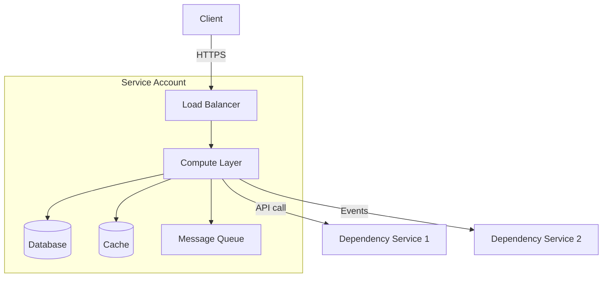

# Service: [ServiceName]

This document describes the architecture, infrastructure, and operational characteristics of [ServiceName].

> **Related**: For feature-level design, see `design/features/`. For workflow orchestration details, see `design/workflows/`. When updating this document, ensure related docs stay consistent.

## Service Overview

- **Team:** [TeamName]
- **On-call:** [rotation link]
- **Repo:** [repo link]
- **Pipeline:** [pipeline link]
- **Primary language:** [e.g., Java 21, Python 3.11, Go 1.22]
- **Framework:** [e.g., Spring Boot, Express, FastAPI, Gin]

## High-Level Architecture Diagram



> Replace with your actual architecture. Use mermaid, ASCII, or link to a diagram.

## Account Structure

| Account | Purpose | Key Resources |
|---------|---------|---------------|
| [Service Account] | [Primary service hosting] | [Compute, DB, Cache, Queues] |
| [Data Account] | [Data storage and processing] | [S3, DynamoDB, RDS] |
| [Monitoring Account] | [Observability] | [CloudWatch, X-Ray, Dashboards] |

## Infrastructure Components

### Compute

- **Type:** [e.g., ECS/Fargate, Lambda, EC2 ASG, EKS]
- **Instance/Task config:** [e.g., 2 vCPU, 4GB RAM per task]
- **Scaling:** [e.g., Target tracking on CPU 70%, min 2 / max 20 tasks]
- **Deployment:** [e.g., Rolling update, Blue/Green, Canary]

### Networking

- **Entry point:** [e.g., ALB, NLB, API Gateway, CloudFront]
- **VPC:** [VPC ID or description]
- **Subnets:** [Public / Private / Isolated — purpose of each]
- **Security groups:** [Key SG rules]
- **DNS:** [Route53 records, custom domains]

### Load Balancing

| Component | Type | Listener | Target | Notes |
|-----------|------|----------|--------|-------|
| [ALB/NLB name] | [Application/Network] | [HTTPS:443] | [Compute on :8080] | [Path-based routing rules] |

### Data Stores

#### [Table/Database 1]
- **Type:** [e.g., DynamoDB, RDS Postgres, Redis]
- **Purpose:** [What data it stores]
- **Key schema:** [Partition key, sort key, GSIs]
- **Billing:** [On-demand / Provisioned]
- **Encryption:** [At rest — KMS / AWS managed]
- **Backup:** [PITR enabled / snapshot schedule]

#### [Table/Database 2]
- **Type:** [e.g., S3, ElastiCache]
- **Purpose:** [What data it stores]
- **Lifecycle:** [Retention, expiration rules]

### Message Queues / Event Streams

| Queue/Topic | Type | Purpose | DLQ | Retention |
|-------------|------|---------|-----|-----------|
| [QueueName] | [SQS FIFO / Standard] | [What triggers it] | [DLQ name, max retries] | [14 days] |
| [TopicName] | [SNS / EventBridge] | [What events it publishes] | — | — |

### IAM Roles

| Role | Trusted Entity | Purpose | Key Permissions |
|------|---------------|---------|-----------------|
| [ExecutionRole] | [ECS / Lambda] | [Service execution] | [DynamoDB, S3, KMS, CloudWatch] |
| [CrossAccountRole] | [Other account] | [Cross-account access] | [Specific resource access] |

### KMS Keys

| Key | Purpose | Rotation | Grants |
|-----|---------|----------|--------|
| [KeyAlias] | [Encrypts data at rest in DDB/S3] | [Enabled / Disabled] | [Which roles have grants] |

## API Operations

### [API Group 1: e.g., Resource Management]

| Operation | Method | Path | Description | Activity/Handler |
|-----------|--------|------|-------------|-----------------|
| Create | POST | /api/v1/resource | [What it does] | [HandlerClass] |
| Get | GET | /api/v1/resource/:id | [What it does] | [HandlerClass] |
| List | GET | /api/v1/resources | [What it does] | [HandlerClass] |
| Update | PUT | /api/v1/resource/:id | [What it does] | [HandlerClass] |
| Delete | DELETE | /api/v1/resource/:id | [What it does] | [HandlerClass] |

## Request Flow

### [Flow 1: e.g., Standard API Request]

```
1. Client → [Load Balancer] (HTTPS :443)
   ↓
2. [Load Balancer] → [Compute] (HTTP :8080)
   - Validates auth, routes by path
   ↓
3. [Compute] → [Handler/Activity]
   - Validates input
   - Business logic
   ↓
4. [Handler] → [Database]
   - Read/write data
   ↓
5. Response flows back through the same path
```

### [Flow 2: e.g., Async Event Processing]

```
1. [Upstream Service] → [SNS Topic]
   ↓
2. [SNS] → [SQS Queue] (cross-account subscription)
   ↓
3. [SQS] → [Lambda / ECS task]
   - Process event
   - Update state in DB
   ↓
4. On failure → [DLQ] (max 3 retries)
```

## Dependencies

| Dependency | Type | How Called | Impact if Down |
|-----------|------|-----------|----------------|
| [ServiceName] | Upstream | [PrivateLink / HTTPS / SDK] | [Cannot process requests] |
| [DatabaseName] | Datastore | [SDK / VPC endpoint] | [Full outage] |
| [QueueName] | Async | [SQS polling] | [Jobs delayed, not lost] |
| [CacheName] | Cache | [Redis client] | [Degraded latency, fallback to DB] |

## Technology Stack

### Application Layer
- **Language:** [e.g., Java 21]
- **Framework:** [e.g., Spring Boot, Express]
- **Build system:** [e.g., Gradle, Maven, npm]
- **DI:** [e.g., Spring, Dagger 2, Guice]
- **Serialization:** [e.g., Jackson, Gson, protobuf]

### Infrastructure Layer
- **IaC:** [e.g., CDK TypeScript, Terraform, CloudFormation]
- **Compute:** [e.g., ECS Fargate, Lambda]
- **Database:** [e.g., DynamoDB, RDS]
- **Observability:** [e.g., CloudWatch, X-Ray, Datadog]

## Security

### Authentication & Authorization
- **Service-to-service:** [e.g., IAM roles, mTLS, API keys]
- **Client-facing:** [e.g., OAuth 2.0, IAM SigV4, JWT]
- **Resource policies:** [e.g., API Gateway resource policy, S3 bucket policy]

### Network Security
- **TLS:** [e.g., TLS 1.2+ required]
- **VPC:** [e.g., Private subnets only, no public internet]
- **Security groups:** [Key ingress/egress rules]

### Data Security
- **Encryption at rest:** [e.g., KMS for DDB/S3, AWS managed for logs]
- **Encryption in transit:** [e.g., HTTPS only, PrivateLink for cross-account]
- **Data isolation:** [How customer data is isolated]

## Monitoring & Alerting

### Key Metrics

| Metric | Normal Range | Alert Threshold | Dashboard |
|--------|-------------|-----------------|-----------|
| Error rate | < [X]% | > [Y]% | [link] |
| P99 latency | < [X]ms | > [Y]ms | [link] |
| P50 latency | < [X]ms | > [Y]ms | [link] |
| CPU utilization | < [X]% | > [Y]% | [link] |
| Request volume | [X]-[Y] RPS | > [Z] RPS | [link] |
| DDB throttles | 0 | > 0 | [link] |

### Key Alarms

| Alarm | Severity | Condition | Action |
|-------|----------|-----------|--------|
| [AlarmName] | Critical | [Error rate > X% for 5 min] | [Page on-call] |
| [AlarmName] | Warning | [Latency > Xms for 10 min] | [Notify team channel] |

### Tracing
- **Tool:** [e.g., X-Ray, Jaeger]
- **Sampling:** [e.g., 5% of requests]

### Logging
- **Log groups:** [List key log groups]
- **Retention:** [e.g., 10 years for audit, 30 days for debug]
- **Format:** [e.g., JSON structured, timestamp format notes]

## Performance Characteristics

| Metric | Value | Notes |
|--------|-------|-------|
| Cold start | [e.g., ~100ms with SnapStart] | [Lambda only] |
| Warm latency P50 | [e.g., ~50ms] | |
| Warm latency P99 | [e.g., ~200ms] | |
| Max throughput | [e.g., 10,000 RPS] | [Before throttling] |
| DDB single-item read | [e.g., ~5-10ms] | |

## Deployment

### Pipeline
- **Tool:** [e.g., GitHub Actions, Jenkins, CodePipeline, Spinnaker]
- **Stages:** [e.g., Beta → Gamma → Prod]
- **Regions:** [List deployment regions]
- **Rollback:** [e.g., Automatic on alarm, manual approval for prod]
- **Bake time:** [e.g., 30 min between stages]

### IaC Stacks
| Stack | Purpose |
|-------|---------|
| [ServiceStack] | [Compute, DB, IAM] |
| [NetworkStack] | [VPC, LB, DNS] |
| [MonitoringStack] | [Alarms, dashboards] |

## Known Failure Modes

| Failure | Symptoms | Mitigation | Runbook |
|---------|----------|------------|---------|
| [DB connection exhaustion] | [Timeout errors, 5xx spike] | [Scale connections, restart tasks] | [link] |
| [Dependency timeout] | [Elevated latency, partial failures] | [Circuit breaker, fallback cache] | [link] |
| [Capacity exhaustion] | [Throttling, 429 errors] | [Scale up, request limit increase] | [link] |

## Key Design Decisions

| Decision | Choice | Rationale |
|----------|--------|-----------|
| [e.g., Compute platform] | [e.g., Lambda over ECS] | [e.g., Lightweight CRUD, cost-efficient for sporadic traffic] |
| [e.g., DB choice] | [e.g., DynamoDB over RDS] | [e.g., Low-latency key-value, no joins needed] |
| [e.g., Event delivery] | [e.g., DDB Streams + Lambda] | [e.g., Decouples publishing from main logic] |

## Glossary

| Abbreviation | Meaning |
|-------------|---------|
| [ABR] | [Full term] |
| [ABR] | [Full term] |

## References

- Architecture design doc: [Link]
- API spec / OpenAPI: [Link]
- Runbook: [Link]
- On-call rotation: [Link]
- Pipeline dashboard: [Link]
