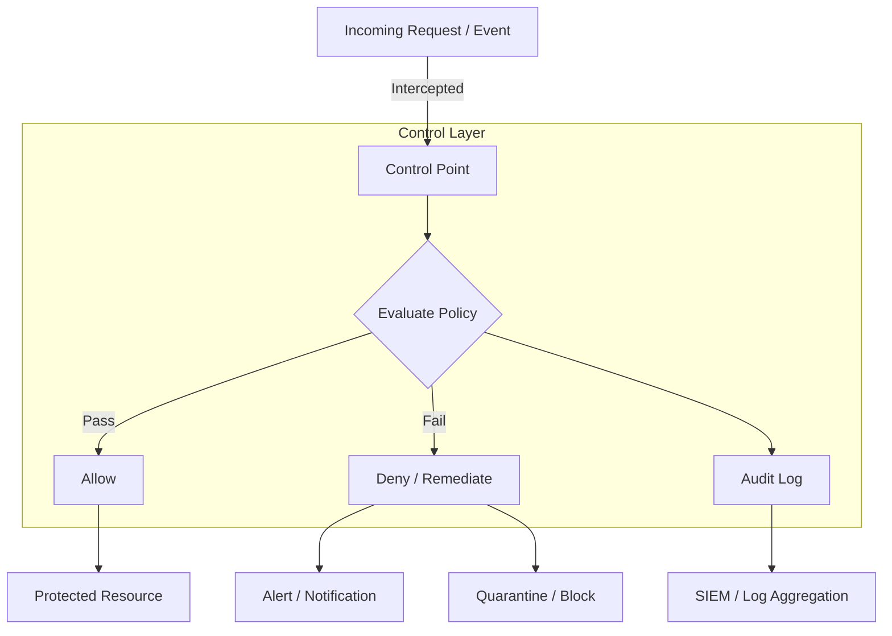

# Security Control: [ControlName]

This document defines the [ControlName] security control, including its architecture, implementation details, configuration, testing strategy, and operational procedures.

> **Related**: For the policy this control enforces, see `design/policies/`. For threat context, see `design/threat_models/`.

## Overview

[One-paragraph description of the control, what risk it mitigates, how it works, and where it sits in the defense-in-depth strategy.]

## Control Metadata

| Field | Value |
|-------|-------|
| **Control ID** | [e.g., SEC-CTL-001] |
| **Control type** | [Preventive / Detective / Corrective / Compensating] |
| **Implementation** | [Automated / Manual / Hybrid] |
| **Risk mitigated** | [e.g., Unauthorized access, Data exfiltration, Secret exposure] |
| **Policy enforced** | [e.g., SEC-POL-001 — Access Control Policy] |
| **Compliance mapping** | [e.g., SOC2 CC6.1, PCI-DSS Req 7.1, HIPAA §164.312(a)] |
| **Applies to** | [e.g., All production accounts, Specific service, All CI/CD pipelines] |
| **Owner** | [team or person] |
| **Effective date** | [date] |
| **Last reviewed** | [date] |
| **Review cadence** | [e.g., Quarterly, Annually] |

## Architecture

### Control Placement



> Replace with your actual control architecture. Show where the control intercepts, what it evaluates, and what happens on pass/fail.

### Defense-in-Depth Context

```
┌─────────────────────────────────────────────────────┐
│ Layer 1: Network Controls                           │
│   [WAF, Security Groups, NACLs, PrivateLink]        │
├─────────────────────────────────────────────────────┤
│ Layer 2: Identity & Access Controls                 │
│   [IAM Policies, SCPs, Resource Policies, MFA]      │
├─────────────────────────────────────────────────────┤
│ Layer 3: Application Controls                       │
│   [Input Validation, AuthZ Middleware, Rate Limits]  │
├─────────────────────────────────────────────────────┤
│ Layer 4: Data Controls                              │
│   [Encryption, Tokenization, DLP, Masking]          │
├─────────────────────────────────────────────────────┤
│ Layer 5: Detective Controls                         │
│   [CloudTrail, GuardDuty, Config Rules, SIEM]       │
└─────────────────────────────────────────────────────┘

  ← [ControlName] operates at Layer [N]
```

## Implementation Details

### Technical Components

| Component | Type | Purpose | Location |
|-----------|------|---------|----------|
| [e.g., WAF WebACL] | [AWS resource] | [Filter malicious requests] | [In front of ALB] |
| [e.g., IAM SCP] | [AWS Organizations] | [Prevent disabling CloudTrail] | [Applied to all OUs] |
| [e.g., Config Rule] | [AWS Config] | [Detect unencrypted S3 buckets] | [All accounts] |
| [e.g., Lambda function] | [Custom code] | [Auto-remediate findings] | [Security account] |
| [e.g., Pre-commit hook] | [CI/CD] | [Block secrets in code] | [All repos] |

### Infrastructure as Code

```
[IaC reference — CDK construct, Terraform module, or CloudFormation snippet]

Example structure:
├── lib/
│   ├── [control-name]-stack.ts        # Main control infrastructure
│   ├── [control-name]-rules.ts        # Policy/rule definitions
│   └── [control-name]-remediation.ts  # Auto-remediation logic
├── config/
│   ├── rules.json                     # Rule configuration
│   └── exceptions.json                # Exception list
└── test/
    └── [control-name].test.ts         # Control validation tests
```

### Decision Logic

```
[Pseudocode or flowchart showing the control's evaluation logic]

WHEN [event/request] is received:
  1. Extract [relevant attributes: identity, resource, action, context]
  2. Check against [policy/rule set]:
     - IF [condition 1]: ALLOW with [logging level]
     - IF [condition 2]: DENY with [error code, message]
     - IF [condition 3]: ALLOW with [compensating control]
  3. IF exception exists for [identity/resource]:
     - Validate exception is not expired
     - Log exception usage
     - ALLOW with enhanced logging
  4. Log decision to [audit log destination]
  5. IF DENY: trigger [alert/notification/quarantine]
```

## Configuration

### Control Parameters

| Parameter | Value | Description | Impact of Change |
|-----------|-------|-------------|-----------------|
| [e.g., Rate limit] | [e.g., 1000 req/s per IP] | [Max requests before throttling] | [Lower = more protection, higher = less friction] |
| [e.g., Block threshold] | [e.g., 5 failed attempts in 10 min] | [Lockout trigger] | [Lower = faster lockout, risk of false positives] |
| [e.g., Scan frequency] | [e.g., Every commit / Every 15 min] | [How often the control evaluates] | [More frequent = faster detection, higher cost] |
| [e.g., Sensitivity level] | [e.g., High / Medium / Low] | [Detection sensitivity] | [Higher = more findings, more false positives] |
| [e.g., Fail mode] | [e.g., Fail-closed / Fail-open] | [Behavior when control is unavailable] | [Fail-closed = safer but may cause outage] |

### Rule Definitions

| Rule ID | Description | Action | Severity | Enabled |
|---------|-------------|--------|----------|---------|
| [RULE-001] | [e.g., Block SQL injection patterns] | [Block] | [Critical] | [Yes] |
| [RULE-002] | [e.g., Rate limit by IP] | [Throttle] | [High] | [Yes] |
| [RULE-003] | [e.g., Geo-block non-approved regions] | [Block] | [Medium] | [Yes] |
| [RULE-004] | [e.g., Log unusual access patterns] | [Log only] | [Low] | [Yes] |

### Environment-Specific Configuration

| Parameter | Development | Staging | Production |
|-----------|-------------|---------|------------|
| [Fail mode] | [Fail-open] | [Fail-closed] | [Fail-closed] |
| [Sensitivity] | [Low] | [Medium] | [High] |
| [Alert destination] | [Log only] | [Team channel] | [PagerDuty + channel] |
| [Auto-remediation] | [Disabled] | [Enabled, dry-run] | [Enabled] |
| [Exception list] | [Broad] | [Narrow] | [Minimal] |

## Monitoring & Alerting

### Key Metrics

| Metric | Normal Range | Warning | Critical | Dashboard |
|--------|-------------|---------|----------|-----------|
| [Control evaluation rate] | [X-Y/min] | [> Z/min] | [> W/min] | [link] |
| [Block/deny rate] | [< X%] | [> Y%] | [> Z%] | [link] |
| [False positive rate] | [< X%] | [> Y%] | [> Z%] | [link] |
| [Control latency (added)] | [< Xms] | [> Yms] | [> Zms] | [link] |
| [Exception usage count] | [< X/day] | [> Y/day] | [> Z/day] | [link] |
| [Control availability] | [> 99.9%] | [< 99.9%] | [< 99%] | [link] |

### Alarms

| Alarm | Severity | Condition | Action |
|-------|----------|-----------|--------|
| [ControlDown] | Critical | [Control unavailable > 5 min] | [Page on-call, activate fail-mode] |
| [HighBlockRate] | High | [Block rate > X% for 10 min] | [Investigate — possible attack or misconfiguration] |
| [HighFalsePositive] | Medium | [False positive rate > X% for 1 hr] | [Review rules, tune sensitivity] |
| [ExceptionAbuse] | High | [Exception used > X times/day] | [Review exception, consider revoking] |
| [ControlDrift] | Medium | [Config differs from IaC baseline] | [Investigate, re-deploy if needed] |

### Audit Logging

| Event | Logged Fields | Destination | Retention |
|-------|--------------|-------------|-----------|
| [Allow decision] | [timestamp, identity, resource, action, rule matched] | [CloudWatch / S3] | [90 days / 7 years] |
| [Deny decision] | [timestamp, identity, resource, action, rule matched, reason] | [CloudWatch / S3 / SIEM] | [7 years] |
| [Exception used] | [timestamp, identity, exception ID, resource] | [CloudWatch / S3 / SIEM] | [7 years] |
| [Config change] | [timestamp, actor, old value, new value] | [CloudTrail / SIEM] | [7 years] |
| [Control failure] | [timestamp, error, fail-mode activated] | [CloudWatch / PagerDuty] | [90 days] |

## Testing

### Test Strategy

| Test Type | Description | Frequency | Owner |
|-----------|-------------|-----------|-------|
| [Unit test] | [Validate decision logic with mock inputs] | [Every commit] | [Dev team] |
| [Integration test] | [Validate control works with real AWS resources] | [Every deploy] | [Dev team] |
| [Penetration test] | [Attempt to bypass control] | [Quarterly / Annually] | [Security team / External] |
| [Chaos test] | [Simulate control failure, verify fail-mode] | [Quarterly] | [SRE team] |
| [Red team exercise] | [Full attack simulation targeting this control] | [Annually] | [Red team] |
| [Regression test] | [Verify control after rule/config changes] | [Every change] | [Dev team] |

### Test Cases

| # | Scenario | Input | Expected Result | Pass/Fail |
|---|----------|-------|-----------------|-----------|
| TC-1 | [Legitimate request] | [Valid auth, normal payload] | [Allow, log] | [ ] |
| TC-2 | [Malicious request] | [SQL injection in parameter] | [Block, alert] | [ ] |
| TC-3 | [Brute force attempt] | [> threshold failed attempts] | [Lock, alert] | [ ] |
| TC-4 | [Exception path] | [Request from excepted identity] | [Allow with enhanced logging] | [ ] |
| TC-5 | [Control unavailable] | [Control service down] | [Fail-mode activates correctly] | [ ] |
| TC-6 | [Config drift] | [Manual change to control config] | [Drift detected, alarm fires] | [ ] |
| TC-7 | [Bypass attempt] | [Encoded/obfuscated payload] | [Block, alert] | [ ] |

### Test Evidence

| Test | Last Run | Result | Evidence | Next Scheduled |
|------|----------|--------|----------|---------------|
| [Penetration test] | [date] | [Pass / Findings] | [Report link] | [date] |
| [Chaos test] | [date] | [Pass / Findings] | [Report link] | [date] |
| [Red team exercise] | [date] | [Pass / Findings] | [Report link] | [date] |

## Failure Modes

| Failure Scenario | Behavior | Impact | Detection | Recovery |
|-----------------|----------|--------|-----------|----------|
| [Control service down] | [Fail-closed: deny all] | [Legitimate requests blocked] | [ControlDown alarm] | [Auto-restart, failover to secondary] |
| [Control service down] | [Fail-open: allow all] | [Unprotected requests pass through] | [ControlDown alarm] | [Auto-restart, manual review of gap period] |
| [Rule misconfiguration] | [False positives spike] | [Legitimate users blocked] | [HighFalsePositive alarm] | [Rollback rule change, review] |
| [Dependency unavailable] | [Cannot evaluate policy] | [Depends on fail-mode setting] | [Dependency health check] | [Cache last-known-good policy, alert] |
| [Log pipeline failure] | [Decisions not audited] | [Compliance gap, no forensic trail] | [Log delivery alarm] | [Buffer logs locally, replay when restored] |

### Fail-Mode Decision Matrix

| Scenario | Fail-Closed | Fail-Open | Recommendation |
|----------|------------|-----------|----------------|
| [Auth control] | [Block all access] | [Allow unauthenticated access] | [Fail-closed — security critical] |
| [Rate limiter] | [Block all traffic] | [Allow unlimited traffic] | [Fail-open — availability critical] |
| [DLP scanner] | [Block all data egress] | [Allow unscanned data out] | [Fail-closed — data protection critical] |
| [Vulnerability scanner] | [Block all deploys] | [Allow unscanned deploys] | [Context-dependent — see policy] |

## Operational Procedures

### Deployment

1. [Deploy IaC changes via pipeline (never manual console changes)]
2. [Deploy to staging first — validate with integration tests]
3. [Enable in dry-run/log-only mode in production]
4. [Monitor for false positives for [N] hours/days]
5. [Switch to enforce mode after validation]
6. [Monitor post-enforcement for [N] hours]

### Rule Updates

1. [Propose rule change via PR with justification]
2. [Security team reviews and approves]
3. [Deploy to staging, run regression tests]
4. [Deploy to production in log-only mode]
5. [Validate no false positive spike]
6. [Enable enforcement]

### Emergency Bypass

> Use only when the control is causing a production outage and cannot be quickly fixed.

1. [Activate break-glass procedure — requires [role] approval]
2. [Apply emergency exception via [mechanism]]
3. [Log bypass with justification, approver, and timestamp]
4. [Set expiry on bypass (max [N] hours)]
5. [Declare incident and begin root cause analysis]
6. [Remove bypass and restore control ASAP]
7. [Post-incident review must include control failure analysis]

### Tuning & Optimization

| Signal | Action | Frequency |
|--------|--------|-----------|
| [High false positive rate] | [Review and refine rules, add exceptions] | [As needed] |
| [New attack patterns observed] | [Add new rules, update signatures] | [As needed] |
| [Performance degradation] | [Optimize evaluation logic, cache policies] | [Quarterly review] |
| [Compliance requirement change] | [Update rules to match new requirements] | [When policy changes] |
| [Exception list growing] | [Review exceptions, remediate root causes] | [Monthly] |

## Exceptions

### Active Exceptions

| # | Exception | Scope | Justification | Compensating Control | Approved By | Expiry | Review |
|---|-----------|-------|--------------|---------------------|------------|--------|--------|
| [1] | [Description] | [Which resource/identity] | [Why needed] | [What mitigates the gap] | [Name/Role] | [date] | [Quarterly] |

### Exception Process

1. [Submit request via [ticketing system] with: scope, justification, compensating control, requested duration]
2. [Security team reviews within [N] business days]
3. [If approved: add to exception list with expiry and compensating control]
4. [If denied: provide alternative approach]
5. [All exceptions auto-expire — must be re-approved or remediated]
6. [Exception usage is monitored and alerted on]

## Compliance Evidence

| Requirement | Control Mapping | Evidence Type | Evidence Location | Collection |
|-------------|----------------|---------------|-------------------|------------|
| [SOC2 CC6.1] | [This control enforces access policy] | [Config audit, access logs] | [S3 bucket / GRC tool] | [Automated daily] |
| [PCI-DSS Req 7.1] | [This control restricts access to need-to-know] | [IAM policy report, access review] | [S3 bucket / GRC tool] | [Automated daily] |
| [HIPAA §164.312(a)] | [This control enforces access controls] | [Audit logs, config snapshots] | [S3 bucket / GRC tool] | [Automated daily] |

## Performance Impact

| Metric | Without Control | With Control | Overhead | Acceptable |
|--------|----------------|-------------|----------|------------|
| [Request latency (P50)] | [Xms] | [X + Yms] | [Yms] | [Yes/No] |
| [Request latency (P99)] | [Xms] | [X + Yms] | [Yms] | [Yes/No] |
| [Throughput] | [X RPS] | [X - Y RPS] | [Y RPS reduction] | [Yes/No] |
| [Cost (monthly)] | [$X] | [$X + $Y] | [$Y/month] | [Yes/No] |

## Dependencies

| Dependency | Type | Impact if Unavailable | Fallback |
|-----------|------|----------------------|----------|
| [IAM service] | [AWS service] | [Cannot evaluate identity policies] | [Fail-closed, cache last-known-good] |
| [KMS] | [AWS service] | [Cannot encrypt/decrypt] | [Fail-closed, alert] |
| [SIEM / Log pipeline] | [Internal service] | [Audit gap — decisions not logged] | [Local buffer, replay on restore] |
| [Config/rule store] | [Internal service] | [Cannot load latest rules] | [Use cached rules, alert] |

## Related Documents

- Policy enforced: `design/policies/[PolicyName].md`
- Threat model: `design/threat_models/[ThreatModelName].md`
- Related controls: `design/controls/[RelatedControl].md`
- Runbook: [Link]
- Architecture diagram: [Link]
- Compliance evidence repository: [Link]
- Incident response playbook: [Link]
