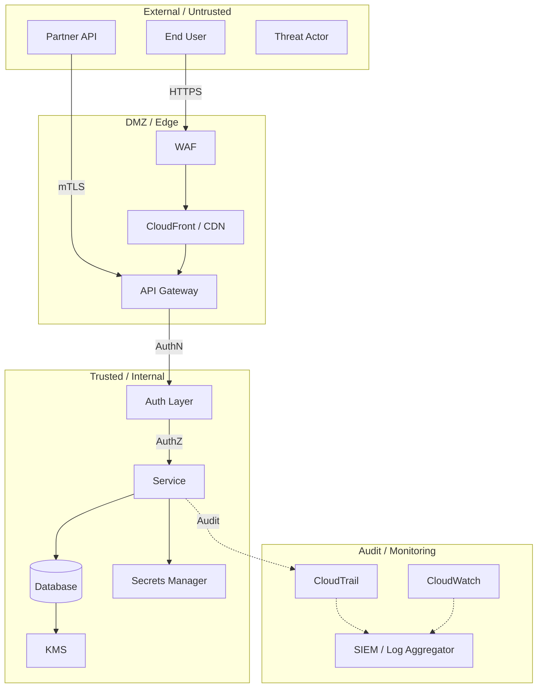

# Threat Model: [ServiceName / FeatureName]

This document describes the threat model for [ServiceName/FeatureName], including assets, trust boundaries, threat analysis, and mitigations.

> **Related**: For security policies, see `design/policies/`. For security controls, see `design/controls/`. When updating this document, ensure related docs stay consistent.

## Overview

[One-paragraph description of what is being threat-modeled, its security context, and why this threat model exists.]

## Scope

- **Service(s) in scope:** [List all services covered]
- **Data classification:** [Confidential / Internal / Public — per data type]
- **Compliance frameworks:** [SOC2, PCI-DSS, HIPAA, FedRAMP, ISO 27001]
- **Last reviewed:** [date]
- **Next review due:** [date]
- **Threat model owner:** [team / person]
- **Reviewers:** [security team, service owners]

## System Architecture (Security View)



> Replace with your actual architecture. Highlight trust boundaries clearly.

## Assets

### Data Assets

| Asset | Classification | Storage | Encryption | Access | Retention |
|-------|---------------|---------|------------|--------|-----------|
| [Customer PII] | Confidential | [RDS encrypted] | [KMS CMK, key rotation enabled] | [Service role only, no human access] | [Per retention policy] |
| [API keys / tokens] | Secret | [Secrets Manager] | [KMS CMK] | [Rotation every 90d, service role only] | [Until rotated] |
| [Audit logs] | Internal | [S3 + CloudWatch] | [SSE-S3 / KMS] | [Security team read-only] | [10 years] |
| [Session data] | Internal | [ElastiCache] | [In-transit + at-rest] | [Service role only] | [TTL: 24h] |
| [Business data] | Internal | [DynamoDB] | [KMS managed] | [Service role, scoped IAM] | [Per data lifecycle] |

### Infrastructure Assets

| Asset | Type | Criticality | Owner |
|-------|------|------------|-------|
| [Production database] | [RDS / DynamoDB] | Critical | [Service team] |
| [KMS encryption keys] | [KMS CMK] | Critical | [Security team] |
| [IAM roles] | [IAM] | High | [Service team + security review] |
| [VPC / Network config] | [VPC] | High | [Platform team] |
| [CI/CD pipeline] | [CodePipeline / GitHub Actions] | High | [Service team] |

## Trust Boundaries

```
┌─────────────────────────────────────────────────────────────────┐
│  BOUNDARY 1: Internet → Edge (Untrusted → Semi-trusted)         │
│                                                                   │
│  [External Users] ──TLS 1.2+──→ [WAF] ──→ [API Gateway / CDN]  │
│                                                                   │
│  Controls: WAF rules, rate limiting, DDoS protection, TLS       │
├─────────────────────────────────────────────────────────────────┤
│  BOUNDARY 2: Edge → Application (Semi-trusted → Trusted)        │
│                                                                   │
│  [API Gateway] ──AuthN/AuthZ──→ [Service Compute]               │
│                                                                   │
│  Controls: IAM auth, JWT validation, resource policies          │
├─────────────────────────────────────────────────────────────────┤
│  BOUNDARY 3: Application → Data (Trusted → Highly Trusted)      │
│                                                                   │
│  [Service] ──IAM Role──→ [Database / S3 / Secrets Manager]      │
│                                                                   │
│  Controls: Least-privilege IAM, encryption, VPC endpoints       │
├─────────────────────────────────────────────────────────────────┤
│  BOUNDARY 4: Cross-Account (Account A → Account B)              │
│                                                                   │
│  [Service A] ──AssumeRole──→ [Service B resources]              │
│                                                                   │
│  Controls: Cross-account IAM, session policies, PrivateLink     │
└─────────────────────────────────────────────────────────────────┘
```

## Threat Analysis (STRIDE)

### Spoofing

| # | Threat | Target | Likelihood | Impact | Mitigation | Status |
|---|--------|--------|-----------|--------|------------|--------|
| S1 | [Forged authentication tokens] | [API Gateway] | [Medium] | [High] | [Token validation, short TTL (1h), token binding to IP] | [Mitigated] |
| S2 | [Stolen service credentials] | [Cross-account access] | [Low] | [Critical] | [Short-lived STS sessions, session policies, CloudTrail monitoring] | [Mitigated] |
| S3 | [Impersonation via leaked API key] | [Customer API] | [Medium] | [High] | [Key rotation, IP allowlisting, usage anomaly detection] | [Mitigated] |

### Tampering

| # | Threat | Target | Likelihood | Impact | Mitigation | Status |
|---|--------|--------|-----------|--------|------------|--------|
| T1 | [Modified request payload in transit] | [API requests] | [Low] | [High] | [TLS 1.2+ required, request signing (SigV4)] | [Mitigated] |
| T2 | [Tampered audit logs] | [CloudTrail / S3] | [Low] | [Critical] | [S3 Object Lock, CloudTrail log file validation, separate audit account] | [Mitigated] |
| T3 | [SQL/NoSQL injection] | [Database queries] | [Medium] | [High] | [Parameterized queries, input validation, WAF rules] | [Mitigated] |

### Repudiation

| # | Threat | Target | Likelihood | Impact | Mitigation | Status |
|---|--------|--------|-----------|--------|------------|--------|
| R1 | [Denied actions without audit trail] | [All API operations] | [Low] | [High] | [CloudTrail enabled, immutable audit logs, request ID tracking] | [Mitigated] |
| R2 | [Disputed data modifications] | [Database changes] | [Low] | [Medium] | [DDB Streams capture all changes, event publishing with timestamps] | [Mitigated] |

### Information Disclosure

| # | Threat | Target | Likelihood | Impact | Mitigation | Status |
|---|--------|--------|-----------|--------|------------|--------|
| I1 | [Verbose error messages leak internals] | [API responses] | [Medium] | [Medium] | [Generic error responses in prod, structured logging (not in response)] | [Mitigated] |
| I2 | [Unauthorized data access via IDOR] | [Resource endpoints] | [Medium] | [High] | [Resource-level authorization checks, account-scoped queries] | [Mitigated] |
| I3 | [Data exfiltration via logs] | [CloudWatch / application logs] | [Low] | [High] | [PII scrubbing in logs, log access restricted to security team] | [Mitigated] |
| I4 | [Secrets in source code] | [Git repository] | [Medium] | [Critical] | [Pre-commit hooks, secrets scanning in CI, Secrets Manager for all secrets] | [Mitigated] |

### Denial of Service

| # | Threat | Target | Likelihood | Impact | Mitigation | Status |
|---|--------|--------|-----------|--------|------------|--------|
| D1 | [API flood / DDoS] | [API Gateway / ALB] | [High] | [High] | [WAF rate limiting, CloudFront, API throttling, auto-scaling] | [Mitigated] |
| D2 | [Resource exhaustion via large payloads] | [Compute layer] | [Medium] | [Medium] | [Request size limits (10MB), timeout configuration, input validation] | [Mitigated] |
| D3 | [Database hot partition] | [DynamoDB] | [Low] | [High] | [Partition key design, on-demand scaling, request throttling] | [Mitigated] |

### Elevation of Privilege

| # | Threat | Target | Likelihood | Impact | Mitigation | Status |
|---|--------|--------|-----------|--------|------------|--------|
| E1 | [IDOR — accessing other accounts' resources] | [All resource endpoints] | [Medium] | [Critical] | [Account-scoped queries, resource-level authz, partition key includes accountId] | [Mitigated] |
| E2 | [Privilege escalation via IAM misconfiguration] | [IAM roles] | [Low] | [Critical] | [Least-privilege policies, IAM Access Analyzer, quarterly access reviews] | [Mitigated] |
| E3 | [Container escape / Lambda breakout] | [Compute layer] | [Very Low] | [Critical] | [AWS managed runtime, no custom AMIs, security group isolation] | [Accepted — AWS shared responsibility] |

## Attack Scenarios

### Scenario 1: [e.g., Account Takeover via Stolen Token]

```
1. Attacker obtains valid auth token (phishing, credential stuffing)
2. Attacker calls API with stolen token
3. DETECTION: Anomaly detection flags unusual IP/geo/behavior
4. RESPONSE: Token revoked, account locked, incident triggered
```

**Mitigations:** [Token binding, IP-based anomaly detection, MFA for sensitive ops]
**Residual risk:** [Low — detection within minutes, limited blast radius per token scope]

### Scenario 2: [e.g., Data Exfiltration via Insider]

```
1. Insider with DB access queries customer data
2. DETECTION: CloudTrail + DDB access logs flag bulk reads
3. RESPONSE: Access revoked, forensic investigation
```

**Mitigations:** [Least-privilege IAM, no direct DB access in prod, audit logging, access reviews]
**Residual risk:** [Medium — insider with service role could access data within service scope]

## Data Flow Diagram (Security Focus)

```
[Customer] ──TLS──→ [WAF] ──→ [API GW] ──AuthN──→ [Service]
                                                        │
                                    ┌───────────────────┼───────────────────┐
                                    │                   │                   │
                                    ▼                   ▼                   ▼
                              [Database]          [Secrets Mgr]       [S3 Bucket]
                              KMS encrypted       KMS encrypted       KMS encrypted
                              VPC endpoint        VPC endpoint        VPC endpoint
                                    │                                      │
                                    ▼                                      ▼
                              [DDB Stream]                           [Access Logs]
                                    │                                      │
                                    ▼                                      ▼
                              [EventBridge]                           [SIEM]
                                    │
                                    ▼
                              [Audit Trail]
```

## Compliance Mapping

| Threat ID | STRIDE | Compliance Requirement | Control | Evidence |
|-----------|--------|----------------------|---------|----------|
| S1 | Spoofing | [SOC2 CC6.1 — Logical access] | [Token validation + MFA] | [Auth config, MFA enrollment rate] |
| T2 | Tampering | [SOC2 CC7.2 — System monitoring] | [Immutable audit logs] | [S3 Object Lock config, CloudTrail validation] |
| I2 | Info Disclosure | [PCI-DSS Req 7 — Restrict access] | [Resource-level authz] | [IAM policy review, access test results] |
| E1 | Elevation | [SOC2 CC6.3 — Role-based access] | [Account-scoped queries] | [Code review, penetration test results] |

## Open Risks

| # | Risk | Severity | Owner | Status | Mitigation Plan | Ticket |
|---|------|----------|-------|--------|-----------------|--------|
| [1] | [Description] | [Critical/High/Medium/Low] | [team] | [Open/Mitigated/Accepted] | [Plan] | [link] |
| [2] | [Description] | [Severity] | [team] | [Status] | [Plan] | [link] |

## Risk Acceptance

| # | Risk | Accepted By | Date | Rationale | Review Date |
|---|------|------------|------|-----------|-------------|
| [1] | [Description] | [Name/Role] | [date] | [Why this risk is accepted] | [Next review] |

## Penetration Testing

| Test | Date | Scope | Findings | Remediation |
|------|------|-------|----------|-------------|
| [Annual pentest] | [date] | [External API surface] | [N findings: X critical, Y high] | [All critical/high remediated by date] |
| [Red team exercise] | [date] | [Full stack] | [N findings] | [Status] |

## Review History

| Date | Reviewer | Changes | Trigger |
|------|----------|---------|---------|
| [date] | [name] | [Initial threat model] | [New service launch] |
| [date] | [name] | [Added IDOR threat] | [Pentest finding] |
| [date] | [name] | [Updated for new feature] | [Feature launch] |

## References

- Architecture doc: `../architecture/[name].md` or [Link]
- Security policies: `design/policies/`
- Security controls: `design/controls/`
- Compliance evidence: [Link]
- Previous threat model: [Link]
- Penetration test report: [Link — restricted access]
- OWASP Threat Modeling: [https://owasp.org/www-community/Threat_Modeling]
